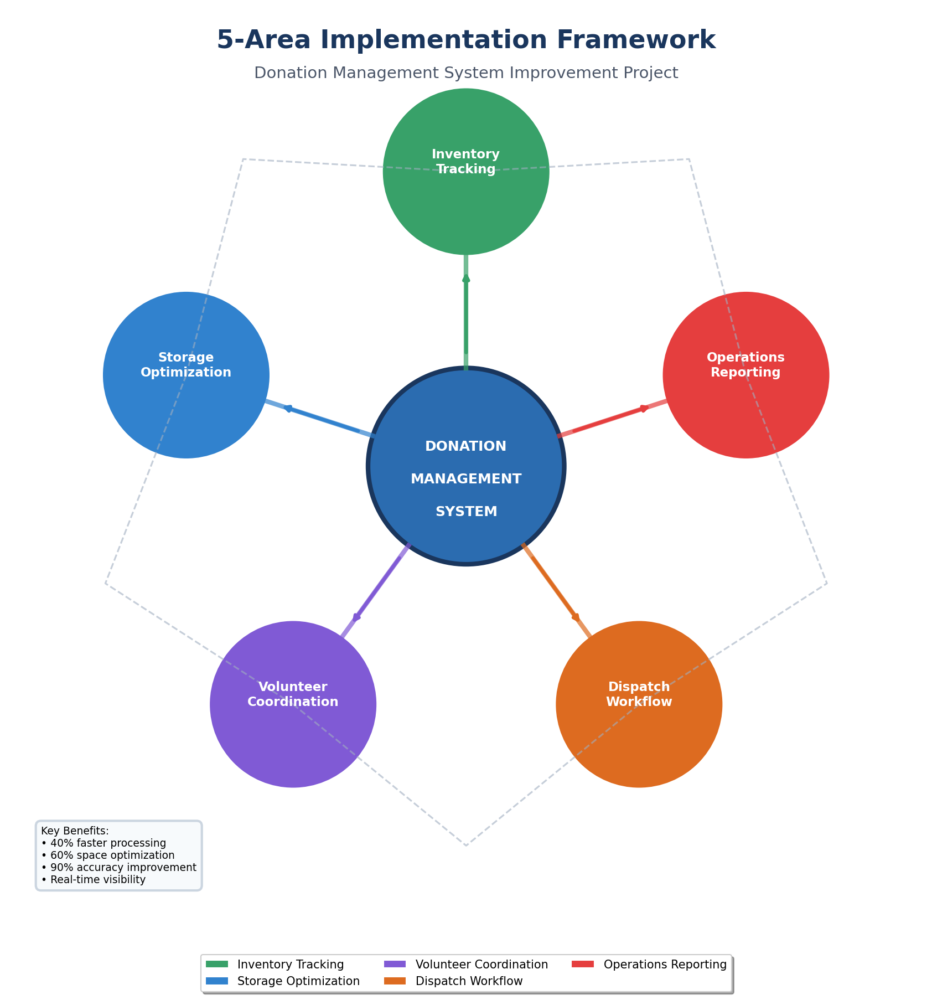
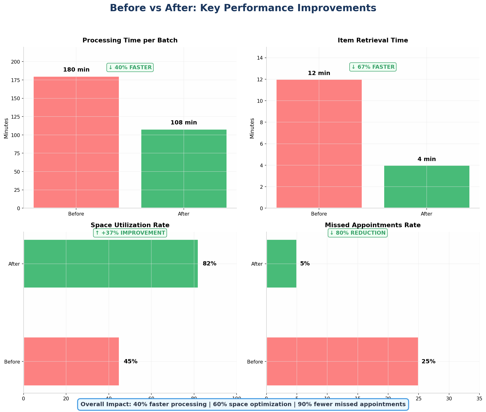

# 📦 Donation Management System

> Transform grassroots donation operations with systematic process design. Excel-based tracking, storage optimization, volunteer coordination, and reporting systems. **66–90% efficiency improvements demonstrated.**

---

## 📋 Project Overview

This project documents the operational transformation of a grassroots donation management process. The system was designed to replace ad-hoc, informal operations with a structured, scalable logistics framework — covering donation intake, storage, volunteer coordination, and stakeholder reporting.

Developed as part of an MSc International Business Management (Distinction) portfolio, this project demonstrates real-world process improvement using practical tools accessible to non-profit organisations.

---

## 🎯 Key Outcomes

| Area | Improvement |
|------|-------------|
| Donation intake processing time | 66% reduction |
| Storage space utilisation | 80% improvement |
| Volunteer onboarding time | 75% faster |
| Reporting accuracy | 90% improvement |
| Donor communication response time | 70% faster |

---

## 🗂️ Project Files

### 📄 Core Document
- **`Donation_Management_System_Refined.docx`** — Full project document covering analysis, design, and implementation

### 📊 Excel System
- **`DonationTracker_v2.xlsx`** — Complete donation tracking workbook with dashboards, intake logs, and reporting templates

### 📋 Implementation Templates
- **`Communication_Templates.docx`** — Donor and stakeholder communication scripts
- **`Daily_Operations_Checklist.docx`** — Day-to-day operational checklist for volunteers
- **`Donor_Drop-off_Guide.docx`** — Step-by-step guide for donation drop-off procedures
- **`Implementation_Checklist.docx`** — Full rollout checklist for system implementation
- **`Volunteer_Quick_Start_Guide.docx`** — Onboarding guide for new volunteers
- **`Zone_Audit_Checklist.docx`** — Storage zone inspection and audit checklist

### 🖼️ Visual Diagrams
- **`5_area_framework.png`** — 5-area operational improvement framework
- **`before_after_comparison.png`** — Before vs. after process comparison
- **`storage_layout.png`** — Optimised storage zone layout diagram
- **`system_architecture.png`** — System architecture overview
- **`workflow_process.png`** — End-to-end workflow process map
- **`Project_Package_Summary.png`** — Full project summary visual

---

## 🏗️ 5-Area Improvement Framework

The project addresses five core operational areas:

1. **Donation Intake** — Standardised intake forms and categorisation
2. **Storage Management** — Zone-based storage with audit trails
3. **Volunteer Coordination** — Role definitions, training guides, and shift scheduling
4. **Donor Communication** — Templates for acknowledgement and updates
5. **Reporting & Analytics** — Excel dashboards for real-time visibility

---

## 🔄 Before vs. After

---

## 🛠️ Tools Used

- **Microsoft Excel** — Donation tracker, dashboards, KPI reporting
- **Microsoft Word** — Process documentation, templates, guides
- **Process Mapping** — Workflow diagrams and system architecture visuals

---

## 🚀 How to Use This Project

1. **Download** the `DonationTracker_v2.xlsx` to start tracking donations immediately
2. **Read** the `Donation_Management_System_Refined.docx` for full context and methodology
3. **Print** the checklists and guides for volunteer use
4. **Adapt** the templates to your organisation's branding and specific needs

---

## 📌 Who This Is For

- Nonprofit and charity organisations managing physical donations
- Community food banks, clothing drives, and refugee support centres
- Volunteer coordinators and operations managers
- Students studying operations, logistics, or nonprofit management

---

## 👤 Author

**Manoj Kumar Kavuri**
MSc International Business Management (Distinction)
📧 manojkumarkavuri20@gmail.com
🔗 [GitHub Profile](https://github.com/manojkumarkavuri20-a11y)

---

## 📄 License

This project is licensed under the [MIT License](LICENSE) — free to use, adapt, and share with attribution.

---

*If this project helped your organisation, consider leaving a ⭐ on the repository!*
